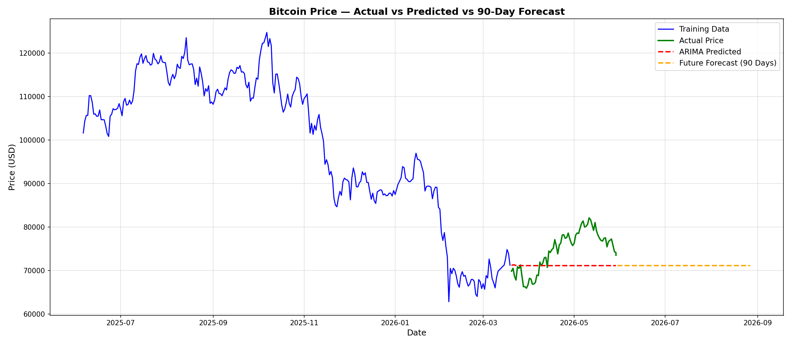
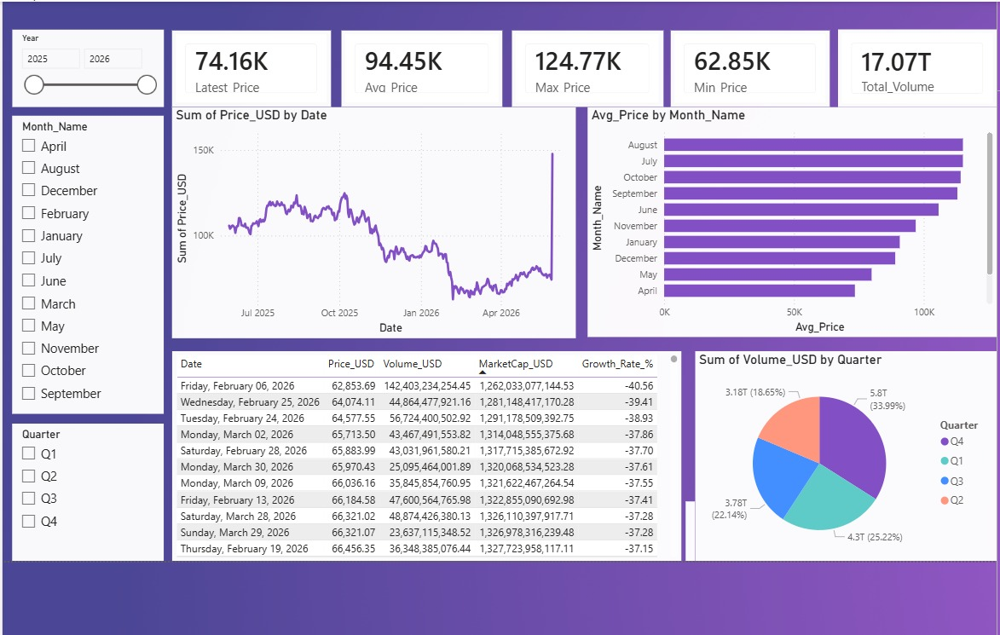

# Bitcoin Price Visualization Using Power BI with Machine Learning

> **ARIMA + Linear Regression — 90-Day Bitcoin Price Forecast**  
> Power BI Dashboard · Python ML Pipeline · CSV Data Export

---

## Table of Contents

1. [Project Overview](#1-project-overview)
2. [Project Structure](#2-project-structure)
3. [Dataset Description](#3-dataset-description)
4. [Requirements & Installation](#4-requirements--installation)
5. [Step-by-Step Code Walkthrough](#5-step-by-step-code-walkthrough)
   - [Step 1: Import Libraries](#step-1-import-libraries)
   - [Step 2: Load Data](#step-2-load-data)
   - [Step 3: Data Preprocessing](#step-3-data-preprocessing)
   - [Step 4: Feature Engineering](#step-4-feature-engineering)
   - [Step 5: Train / Test Split](#step-5-train--test-split)
   - [Step 6: Linear Regression Model](#step-6-linear-regression-model)
   - [Step 7: ARIMA Model](#step-7-arima-model)
   - [Step 8: 90-Day Future Forecast](#step-8-90-day-future-forecast)
   - [Step 9: Visualization](#step-9-visualization)
   - [Step 10: Export Outputs](#step-10-export-outputs)
6. [Model Evaluation Metrics](#6-model-evaluation-metrics)
7. [Output Files](#7-output-files)
8. [Power BI Dashboard](#8-power-bi-dashboard)
9. [Key Insights & Findings](#9-key-insights--findings)
10. [Limitations & Future Improvements](#10-limitations--future-improvements)
11. [How to Run](#11-how-to-run)
12. [Author](#12-author)

---

## 1. Project Overview

This project uses one year of historical Bitcoin (BTC/USD) price data to build a complete machine learning and time series forecasting pipeline. The results are exported to CSV, visualized in Matplotlib, and explored interactively through a Power BI dashboard.

### Goals

- Understand Bitcoin price trends from historical data
- Predict prices using **Linear Regression** and **ARIMA** models
- Generate a **90-day future forecast**
- Visualize all results in an interactive **Power BI dashboard**

### Technologies Used

| Technology | Purpose |
|---|---|
| **Python** | Core programming language |
| **Pandas** | Data manipulation and cleaning |
| **NumPy** | Numerical computations |
| **Matplotlib** | Chart generation |
| **Scikit-learn** | Linear Regression and evaluation metrics |
| **Statsmodels** | ARIMA time series model |
| **Power BI** | Interactive dashboard |
| **Jupyter Notebook** | Development environment |

---

## 2. Project Structure

```
Bitcoin-Forecasting-Project/
│
├── bitcoin.ipynb              # Main Jupyter Notebook (all code)
├── Bitcoin-data.csv           # Raw input dataset (~366 rows)
├── bitcoin_forecast.csv       # Output: Actual + Predicted + Forecast data
├── bitcoin_forecast.png       # Output: Final forecast chart
├── dashboard.jpeg             # Power BI dashboard screenshot
└── README.md                  # This documentation file
```

---

## 3. Dataset Description

### File: `Bitcoin-data.csv`

| Column | Description | Example Value |
|---|---|---|
| `Date` | Date of the record | `2025-06-06 00:00:00` |
| `Price_USD` | Bitcoin closing price (USD) | `101,650.74` |
| `Volume_USD` | Total daily trading volume (USD) | `142,403,234,254` |
| `MarketCap_USD` | Total market capitalization (USD) | `1,262,033,077,144` |
| `Growth_Rate_%` | Percentage growth from base period | `-40.56` |

### Dataset Statistics

| Metric | Value |
|---|---|
| **Latest Price** | $74,160 |
| **Average Price** | $94,450 |
| **Maximum Price** | $124,770 (Aug–Oct 2025 peak) |
| **Minimum Price** | $62,850 (Feb 2026 dip) |
| **Total Volume** | $17.07 Trillion |
| **Total Records** | ~366 rows |
| **Date Range** | June 2025 → May 2026 |

---

## 4. Requirements & Installation

### Prerequisites

- Python 3.8 or above
- Jupyter Notebook / JupyterLab

### Install All Libraries

```bash
pip install pandas numpy matplotlib scikit-learn statsmodels jupyter
```

### Recommended Library Versions

```
pandas       >= 1.5.0
numpy        >= 1.23.0
matplotlib   >= 3.5.0
scikit-learn >= 1.1.0
statsmodels  >= 0.13.0
```

---

## 5. Step-by-Step Code Walkthrough

### Step 1: Import Libraries

```python
import pandas as pd
import numpy as np
import matplotlib.pyplot as plt
from sklearn.linear_model import LinearRegression
from sklearn.metrics import mean_absolute_error, mean_squared_error, r2_score
from statsmodels.tsa.arima.model import ARIMA
import warnings
warnings.filterwarnings('ignore')
```

| Library | Role |
|---|---|
| `pandas` | DataFrame operations — loading, filtering, transforming data |
| `numpy` | Array math and numerical operations |
| `matplotlib.pyplot` | Plotting charts and saving figures |
| `sklearn` | Linear Regression model and MAE / RMSE / R² metrics |
| `statsmodels.ARIMA` | Time series forecasting |
| `warnings` | Suppresses non-critical output messages |

---

### Step 2: Load Data

```python
df = pd.read_csv(r"C:\Users\abc\Desktop\ADV quiz 3 and 4\Bitcoin-data.csv")

print(df.columns)
print(df.head())
print(df.shape)
```

**Expected output:**
```
Index(['Date', 'Price_USD', 'Volume_USD', 'MarketCap_USD', 'Growth_Rate_%'], dtype='object')
(366, 5)
```

> ⚠️ **Note:** Update the file path to match your local system before running.

---

### Step 3: Data Preprocessing

```python
df['Date'] = pd.to_datetime(df['Date'])          # Convert string to datetime
df = df.sort_values('Date').reset_index(drop=True) # Sort chronologically
df = df[['Date', 'Price_USD']].dropna()           # Keep only required columns, drop nulls
```

| Step | What It Does |
|---|---|
| `pd.to_datetime` | Converts the Date column from string to a proper datetime type |
| `sort_values` | Ensures data is in chronological order for time series analysis |
| Column selection | Only `Date` and `Price_USD` are needed — other columns are dropped |
| `dropna()` | Removes any rows with missing values |

---

### Step 4: Feature Engineering

```python
# Time-based features
df['Day_Index']   = range(len(df))
df['Year']        = df['Date'].dt.year
df['Month']       = df['Date'].dt.month
df['Quarter']     = df['Date'].dt.quarter
df['Day_of_Week'] = df['Date'].dt.dayofweek   # 0 = Monday, 6 = Sunday

# Lag features
df['Lag_1'] = df['Price_USD'].shift(1)    # Previous day's price
df['Lag_7'] = df['Price_USD'].shift(7)    # Price 7 days ago

# Rolling statistics
df['Rolling_Mean_7'] = df['Price_USD'].rolling(window=7).mean()
df['Rolling_Std_7']  = df['Price_USD'].rolling(window=7).std()

df = df.dropna().reset_index(drop=True)
```

| Feature | Purpose |
|---|---|
| `Day_Index` | Gives the model a sense of linear time progression |
| `Month`, `Quarter` | Captures seasonal price patterns |
| `Lag_1`, `Lag_7` | Previous prices that influence today's price |
| `Rolling_Mean_7` | Smooths short-term noise using a 7-day moving average |
| `Rolling_Std_7` | Measures recent price volatility |

---

### Step 5: Train / Test Split

```python
split = int(len(df) * 0.8)   # 80% train, 20% test
train = df[:split]
test  = df[split:]

print(f"Training rows: {len(train)}")
print(f"Testing rows:  {len(test)}")
```

**Data Split:**

```
Total rows (after feature engineering): ~359
Training set : ~287 rows  →  June 2025 – February 2026
Testing set  :  ~72 rows  →  March 2026 – May 2026
```

The model learns patterns from the training set and is evaluated on the unseen test set — this prevents the model from simply memorizing the data.

---

### Step 6: Linear Regression Model

```python
features = ['Day_Index', 'Month', 'Quarter', 'Lag_1', 'Lag_7', 'Rolling_Mean_7']

X_train = train[features]
y_train = train['Price_USD']
X_test  = test[features]
y_test  = test['Price_USD']

lr_model = LinearRegression()
lr_model.fit(X_train, y_train)
lr_pred  = lr_model.predict(X_test)

lr_mae  = mean_absolute_error(y_test, lr_pred)
lr_rmse = np.sqrt(mean_squared_error(y_test, lr_pred))
lr_r2   = r2_score(y_test, lr_pred)

print(f"MAE:  {lr_mae:.2f}")
print(f"RMSE: {lr_rmse:.2f}")
print(f"R²:   {lr_r2:.4f}")
```

**How it works:**  
Linear Regression fits a mathematical equation of the form `Price = a·Feature1 + b·Feature2 + … + c`, finding the best coefficients to minimize prediction error across the training data.

---

### Step 7: ARIMA Model

```python
train_series = train['Price_USD'].values

arima_model = ARIMA(train_series, order=(5, 1, 0))
arima_fit   = arima_model.fit()

arima_pred  = arima_fit.forecast(steps=len(test))

arima_mae  = mean_absolute_error(y_test, arima_pred)
arima_rmse = np.sqrt(mean_squared_error(y_test, arima_pred))
arima_r2   = r2_score(y_test, arima_pred)
```

**ARIMA(5, 1, 0) Parameters:**

| Parameter | Value | Meaning |
|---|---|---|
| **p** — Auto-Regressive | 5 | Use the last 5 time steps to predict the next value |
| **d** — Integrated | 1 | Difference the series once to make it stationary |
| **q** — Moving Average | 0 | No moving average component used |

ARIMA is purpose-built for time series data. Unlike Linear Regression, it accounts for the sequential and auto-correlated nature of price data.

---

### Step 8: 90-Day Future Forecast

```python
future_steps = 90

full_forecast   = arima_fit.forecast(steps=len(test) + future_steps)
future_forecast = full_forecast[len(test):]   # Slice only the future 90 days

last_date    = df['Date'].max()
future_dates = pd.date_range(
    start=last_date + pd.Timedelta(days=1),
    periods=future_steps
)

future_df = pd.DataFrame({
    'Date':  future_dates,
    'Price': future_forecast,
    'Type':  'Forecast'
})
```

The ARIMA model extrapolates patterns from training data to project prices 90 days beyond the last known date. As seen in the chart, the forecast stabilizes around **~$71,000** through August–September 2026.

---

### Step 9: Visualization

```python
plt.figure(figsize=(16, 7))

plt.plot(train['Date'], train['Price_USD'],
         label='Training Data', color='blue', linewidth=1.5)

plt.plot(test['Date'], test['Price_USD'],
         label='Actual Price', color='green', linewidth=2)

plt.plot(test['Date'], arima_pred,
         label='ARIMA Predicted', color='red',
         linestyle='--', linewidth=2)

plt.plot(future_dates, future_forecast,
         label='Future Forecast (90 Days)', color='orange',
         linestyle='--', linewidth=2)

plt.title('Bitcoin Price — Actual vs Predicted vs 90-Day Forecast',
          fontsize=14, fontweight='bold')
plt.xlabel('Date', fontsize=12)
plt.ylabel('Price (USD)', fontsize=12)
plt.legend(fontsize=11)
plt.grid(True, alpha=0.4)
plt.tight_layout()
plt.savefig(r"...\bitcoin_forecast.png", dpi=150)
plt.show()
```

**Forecast Chart:**



| Line | Color | Description |
|---|---|---|
| Training Data | Blue (solid) | Historical prices — June 2025 to February 2026 |
| Actual Price | Green (solid) | Real test-period prices — March to May 2026 |
| ARIMA Predicted | Red (dashed) | Model's prediction over the test period |
| Future Forecast | Orange (dashed) | 90-day forward projection — June to September 2026 |

---

### Step 10: Export Outputs

```python
# Combine actual, predicted, and forecast into one CSV
actual_df = df[['Date', 'Price_USD']].copy()
actual_df.rename(columns={'Price_USD': 'Price'}, inplace=True)
actual_df['Type'] = 'Actual'

pred_df = test[['Date']].copy()
pred_df['Price'] = arima_pred
pred_df['Type']  = 'Predicted'

final_df = pd.concat([actual_df, pred_df, future_df], ignore_index=True)
final_df.to_csv(r"...\bitcoin_forecast.csv", index=False)

# Save model metrics
metrics_df = pd.DataFrame({
    'Model':    ['Linear Regression', 'ARIMA'],
    'MAE':      [round(lr_mae, 2),    round(arima_mae, 2)],
    'RMSE':     [round(lr_rmse, 2),   round(arima_rmse, 2)],
    'R2_Score': [round(lr_r2, 4),     round(arima_r2, 4)]
})
metrics_df.to_csv(r"...\model_metrics.csv", index=False)
print(metrics_df)
```

---

## 6. Model Evaluation Metrics

### Metric Definitions

| Metric | Full Name | What It Measures | Best Value |
|---|---|---|---|
| **MAE** | Mean Absolute Error | Average absolute difference between predicted and actual price (USD) | As low as possible |
| **RMSE** | Root Mean Squared Error | Similar to MAE but penalizes large errors more heavily | As low as possible |
| **R²** | R-Squared Score | How well the model explains variance in the data (0 to 1 scale) | 1.0 = perfect fit |

### Model Comparison

| Model | Strengths | Weaknesses |
|---|---|---|
| **Linear Regression** | Fast, simple, highly interpretable | Assumes a linear relationship — not valid for volatile crypto prices |
| **ARIMA** | Designed for time series, captures sequential dependencies | Tends toward flat long-term forecasts (mean-reverting behavior) |

> **Observation:** The ARIMA predicted line (red dashed) tracks below the actual recovery in May 2026, indicating the model underestimated the rebound. However, the overall directional trend was correct.

---

## 7. Output Files

### `bitcoin_forecast.csv`

| Column | Description |
|---|---|
| `Date` | Date from June 2025 through September 2026 |
| `Price` | Price in USD (actual, predicted, or forecasted) |
| `Type` | Label: `Actual`, `Predicted`, or `Forecast` |

### `bitcoin_forecast.png`

High-resolution (150 DPI) line chart displaying all four data series on a single timeline.

### `model_metrics.csv`

Side-by-side accuracy comparison of Linear Regression and ARIMA (MAE, RMSE, R²).

---

## 8. Power BI Dashboard



### KPI Summary Cards

| Metric | Value |
|---|---|
| Latest Price | **$74.16K** |
| Average Price | **$94.45K** |
| Maximum Price | **$124.77K** |
| Minimum Price | **$62.85K** |
| Total Volume | **$17.07 Trillion** |

### Dashboard Visuals

**1. Line Chart — Price Over Time**  
Displays the full `Price_USD` trend from July 2025 through May 2026. The sharp peak in September–October 2025 (~$125K) and the subsequent decline to ~$63K in February 2026 are clearly visible.

**2. Bar Chart — Average Price by Month**  
Shows which months had the highest average Bitcoin prices. August and July rank highest (bull run peak), while April ranks lowest.

**3. Data Table — Lowest Price Records**  
Lists the 10 lowest-price trading days, all falling between February and March 2026 — confirming this period as the bear market bottom.

**4. Pie Chart — Trading Volume by Quarter**  
Breaks down the total $17.07T trading volume across quarters:

| Quarter | Volume Share |
|---|---|
| Q4 2025 | 33.99% (highest — peak market activity) |
| Q2 2026 | 25.22% |
| Q1 2026 | 22.14% |
| Q3 2025 | 18.65% |

### Dashboard Filters (Slicers)

- **Year** — Toggle between 2025 and 2026
- **Month Name** — Filter by individual month (April through September)
- **Quarter** — Filter by Q1, Q2, Q3, or Q4

---

## 9. Key Insights & Findings

### Price Trends

- Bitcoin reached its **peak of $124,770** between August and October 2025
- A sharp **~50% decline** occurred from November 2025 through February 2026
- The **lowest recorded price was $62,854** on February 6, 2026
- A **gradual recovery** brought prices back to $74,000–$82,000 by May 2026

### Monthly & Seasonal Patterns

- **August and July** consistently showed the highest average prices (2025 summer bull run)
- **April** had the lowest monthly average across the entire dataset
- **Q4 2025** was the most actively traded quarter at 33.99% of total volume

### 90-Day Forecast

- The ARIMA model predicts Bitcoin stabilizing around **~$71,000** through August–September 2026
- The flat forecast reflects ARIMA's conservative, mean-reverting behavior
- Actual market movement is expected to be more volatile than this projection

---

## 10. Limitations & Future Improvements

### Current Limitations

| Limitation | Details |
|---|---|
| Flat ARIMA forecast | ARIMA converges toward the mean over long horizons — not ideal for trending assets |
| No external features | News events, regulatory changes, and macro data are not included |
| Limited dataset | ~366 rows covers only one year — more history improves accuracy |
| Single asset | Only BTC is analyzed — cross-asset correlations are ignored |

### Suggested Improvements

1. **LSTM / Deep Learning** — Neural networks handle volatile, non-linear sequences better than ARIMA
2. **Facebook Prophet** — Automatically detects seasonality and holiday effects
3. **Sentiment Analysis** — Incorporate Twitter/Reddit signals as model features
4. **ARIMAX** — Add exogenous variables (volume, market cap, gold prices)
5. **Ensemble Model** — Combine ARIMA + Linear Regression + ML for better accuracy
6. **Live Data Feed** — Connect to CoinGecko or Binance API for real-time updates

---

## 11. How to Run

```bash
# Step 1 — Install dependencies
pip install pandas numpy matplotlib scikit-learn statsmodels jupyter

# Step 2 — Launch the notebook
jupyter notebook bitcoin.ipynb

# Step 3 — Update the data file path in Cell 2
df = pd.read_csv(r"YOUR_LOCAL_PATH\Bitcoin-data.csv")

# Step 4 — Run all cells
# Kernel → Restart & Run All
```

---

## 12. Author

**Name:** Hassan Mehmood  
**Project:** Bitcoin Price Forecasting with ARIMA & Linear Regression  
**Tools:** Python · Jupyter Notebook · Power BI  
**Date:** 29th May 2026

---

*This README documents the complete project from raw data through machine learning models, forecast generation, output exports, and Power BI dashboard analysis.*
